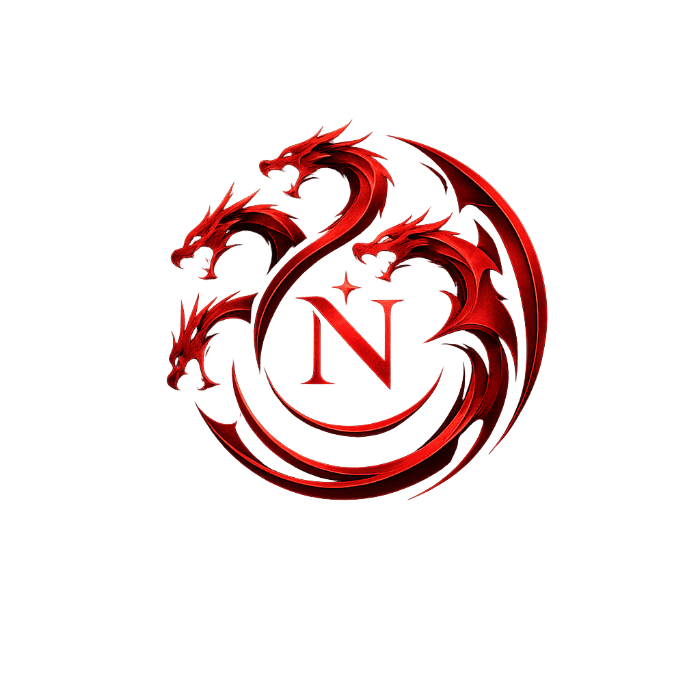

# Nez AI

<p align="center">
  
</p>

Nez AI is a privacy-first local AI assistant built with a React frontend and a Spring Boot backend. The application runs chat, image understanding, PDF understanding, and optional offline voice transcription entirely through local components, with Ollama handling model inference on the machine.

This repository contains the full local-first stack for experimenting with a private AI chat experience without sending prompts, images, PDFs, or voice data to cloud services.

## Overview

Nez AI currently provides:

- a local chat interface for text prompts
- image attachment support via a dedicated image picker
- PDF attachment support via a dedicated PDF picker
- optional offline speech-to-text transcription with whisper.cpp
- persistent conversation history in the browser

## Features

- Local chat with Ollama using the configured model
- Image attachments for multimodal prompts
- PDF attachments for document-focused prompts
- PDF processing entirely on the local machine
- Voice input recording and transcription locally
- Conversation persistence in the browser
- Dark, modern chat UI built with React and Vite

## Architecture

Nez AI uses a simple layered architecture:

- Frontend: React, TypeScript, Vite, and framer-motion
- Backend: Spring Boot with REST endpoints for chat and speech transcription
- Model runtime: Ollama for local chat responses
- PDF pipeline: Apache PDFBox for local text extraction and chunking
- Voice pipeline: whisper.cpp for local transcription

### Request flow

Image requests follow the image path:

Image -> ChatController -> ChatService -> OllamaService (vision-capable flow)

PDF requests follow the PDF path:

PDF -> ChatController -> ChatService -> PdfService -> OllamaService

The image and PDF pipelines are kept separate so image understanding and PDF understanding do not share the same processing path.

## Tech stack

### Frontend

- React 19
- TypeScript
- Vite
- framer-motion
- lucide-react

### Backend

- Java 21
- Spring Boot 4.1.0
- Apache PDFBox 2.0.30
- Ollama via HTTP API
- whisper.cpp integration for local transcription

## Installation

### Prerequisites

- Java 21
- Node.js 20 or newer
- npm
- Ollama
- Optional: whisper.cpp and a local model for offline voice input

### 1. Clone the repository

```powershell
git clone <your-repository-url> Nez-Ai
cd Nez-Ai
```

### 2. Install frontend dependencies

```powershell
cd frontend
npm install
```

### 3. Install and run Ollama

Install Ollama from the official download page and pull the default model:

```powershell
ollama pull qwen3.5:4b
ollama list
```

Start the local Ollama server if needed:

```powershell
ollama serve
```

### 4. Start the backend

```powershell
cd backend\nezai
.\mvnw.cmd spring-boot:run
```

The backend listens on http://localhost:8081.

### 5. Start the frontend

```powershell
cd frontend
npm run dev
```

Open http://localhost:5173 in your browser.

## Configuration

The main backend configuration is in [backend/nezai/src/main/resources/application.properties](backend/nezai/src/main/resources/application.properties).

Key settings include:

```properties
ollama.url=http://localhost:11434
ollama.model=qwen3.5:4b
spring.servlet.multipart.max-file-size=20MB
spring.servlet.multipart.max-request-size=20MB
```

Optional voice settings:

```properties
speech.whisper.executable=tools/whisper/Release/whisper-cli.exe
speech.whisper.model=models/ggml-base.en.bin
speech.whisper.language=en
speech.whisper.threads=4
```

## PDF support

PDF support is implemented as a separate pipeline from image support.

- Apache PDFBox is used for local PDF processing.
- PDFs are processed entirely locally.
- Text is extracted using PDFBox.
- The extracted text is chunked.
- Relevant chunks are selected based on the user prompt.
- Only those chunks are sent to Ollama.
- The original PDF never leaves the local machine.

PDF understanding is therefore a document pipeline, not an image pipeline.

## Vision support

Images are attached through a dedicated image picker and sent through the image-oriented request flow. The backend routes image requests through the chat service and the Ollama-based multimodal flow.

## Voice support

Voice input is optional and runs locally:

- the browser records audio after the user presses the microphone button
- audio is converted to a 16 kHz mono WAV file in the browser
- the WAV is sent to the local Spring Boot server
- the server runs whisper.cpp locally and returns transcribed text
- the transcript is inserted into the composer for review before sending

## Conversation persistence

Conversation history is stored in browser local storage. Messages preserve their text and attachment metadata so the UI can restore prior sessions on reload.

## Privacy

Nez AI is designed to stay local-first:

- text prompts are handled by a local Ollama instance
- uploaded images are processed through the local application flow
- PDFs are processed locally with PDFBox
- voice transcription uses a local whisper.cpp executable
- no cloud AI provider is required for the current implementation

## Screenshots

Placeholder for screenshots:

- Home chat interface
- Image attachment flow
- PDF attachment flow
- Voice input flow

## Development

### Frontend checks

```powershell
cd frontend
npm run build
```

### Backend checks

```powershell
cd backend\nezai
.\mvnw.cmd test
```

## Project structure

```text
frontend/              React + Vite + TypeScript UI
backend/nezai/         Spring Boot backend, services, and local integrations
docs/                  Setup and feature documentation
backend/nezai/tools/   whisper.cpp assets
backend/nezai/models/  local model files
```

## Roadmap

Possible next steps for the project include:

- richer PDF extraction and layout handling
- more explicit image and PDF UI affordances in the conversation view
- stronger error handling and diagnostics for attachment failures
- expanded documentation and contributor setup notes

## Contributing

Contributions are welcome. Please open an issue or pull request with a clear explanation of the change and any relevant testing details.

## License

This project is currently distributed under the repository license. Please review [LICENSE](LICENSE) for details.

## Acknowledgements

- Ollama for local model inference
- Apache PDFBox for local PDF text extraction
- whisper.cpp for local speech recognition
- React, Vite, Spring Boot, and the wider open-source ecosystem
